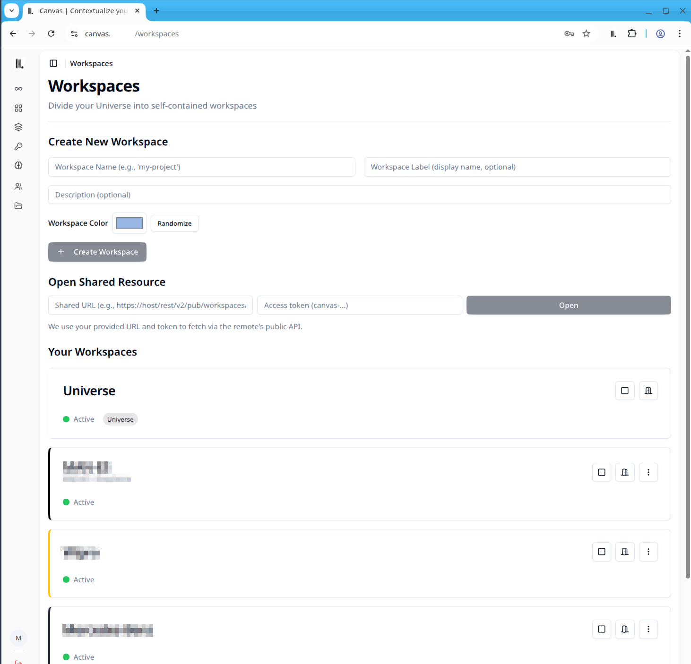
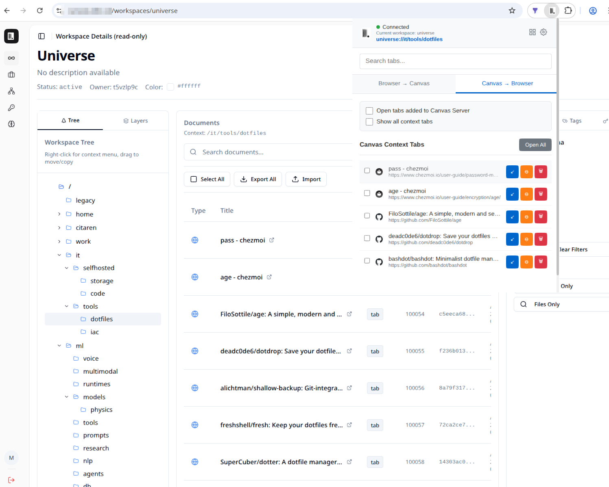
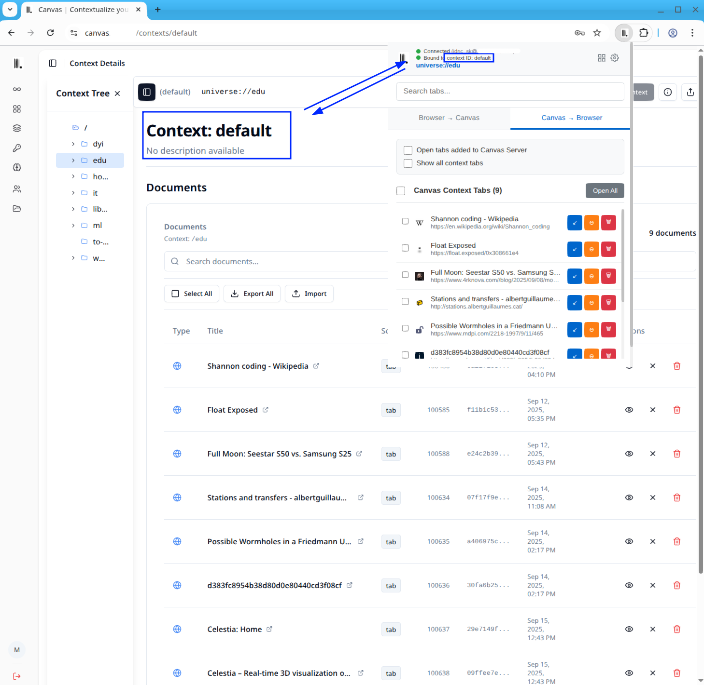

<p align="center">
  
</p>

# Canvas web frontend

- Bundled with [Canvas Server](https://github.com/canvas-ui/canvas-server)  
- For standalone deployment, see the installation section below

## Apps (applets)

The Toolbox has a top-level **Apps** tab hosting small self-contained applets
(`src/components/toolbox/applets/`). Each applet declares which modes it
supports (`context` and/or `global`) and renders free of page-level assumptions,
so the same component can be reused by other frontends (desktop overlay, tauri).

- **Notes** — every note in the focused context stacked as one editable,
  searchable document view with debounced autosave and inline add.
- **Todos** — the same stacked view with status checkboxes, due dates, and
  completed items hidden behind an eye toggle.
- Per item: **Link To** (file into any workspace/path) and **Delete**.

Applets also run standalone, outside the app shell, at `/apps/<id>` — the data
binding lives in the URL (`?workspace=&path=` or `?context=<id>`, `add=1` opens
the inline draft). `/apps/add/<kind>` (note|todo|link|file|photo) is a chrome-free
quick-add card, and the PWA manifest exposes shortcuts for Add Photo / Add File / Add Note / Add Todo.

## Data management

- **Import / export documents** — the document toolbar exports the selected
  (or all) documents as JSON and imports pasted JSON, in both workspace and
  context detail views.
- **Drag and drop** — tree layers and documents are draggable: drop documents
  onto tree paths, copy/move layers between paths (modifier keys switch mode),
  and transfer between side-by-side workspace panes (F5 copy, F6 move).
- **Context sharing** — contexts can be shared with other users by email with
  per-user access levels, managed from the context settings page.

## Screenshots

### Workspace Management


### Workspace Detail

Workspace connected to a browser running [canvas-browser-extension](https://github.com/canvas-ui/canvas-browser-extension)


### Context detail

Context-bound browser with real-time data sync


## Installation (standalone)

### Prerequisites
- Node.js >= 22
- pnpm (via `corepack enable`; the version is pinned in `package.json`)

### Setup
1. **Clone this repository**
   ```bash
   git clone https://github.com/canvas-ui/canvas-web
   cd canvas-web
   ```

2. **Install dependencies**
   ```bash
   pnpm install
   ```

3. **Build the web frontend**
   ```bash
   pnpm run build
   ```

### Development
```bash
# Start development server
pnpm run dev

# Build for production
pnpm run build

# Preview production build
pnpm run preview

# Lint code
pnpm run lint
```

## Shared packages and releases

`@augmentd-labs/canvas-{protocol,api-client,wallpapers}` are npm packages
published from [canvas-common](https://github.com/canvas-ui/canvas-common);
`pnpm update @augmentd-labs/canvas-protocol` (etc.) picks up a new release.

- Every push to `main` republishes the **`web-dist`** branch (dist.yml), which
  canvas-server installs as `"canvas-web": "github:canvas-ui/canvas-web#web-dist"`.
- `pnpm run release tag --bump patch` bumps, tags `vX.Y.Z` and lets
  release.yml attach the prebuilt tarball to a GitHub Release.

## Configuration

### Remote Access
```bash
# Copy environment template
cp .env.example .env

# Update Canvas Server API URL for remote access
VITE_API_URL=http://your-server:8001
```

### Environment Variables
| Variable | Default |
|----------|---------|
| `VITE_API_URL` | `http://localhost:8001` |
| `CANVAS_API_PORT` | `8001` |
| `CANVAS_API_HOST` | `0.0.0.0` | 
| `CANVAS_API_PROTOCOL` | `http` |

## Licence

Copyright (C) 2025-2026 Jozef Melich. Canvas Web UI is dual-licensed:

- **[AGPL-3.0-or-later](LICENSE)**, free for everyone. Run it, modify it, build
  on it. If you distribute a modified version, or expose one to users over a
  network, they are entitled to your changes (AGPL section 13).
- **[Commercial licence](COMMERCIAL.md)**, the same code without the copyleft
  obligations, for hosted products and proprietary distribution. Issued by
  Augmentd s.r.o., lic@augmentd.eu.

Same software either way. There is no cut-down community edition. See
[NOTICE](NOTICE) for the full position, and [CONTRIBUTING.md](CONTRIBUTING.md)
before opening a pull request.

---
This project is funded by [Augmentd Labs](https://augmentd.eu/en/labs)
